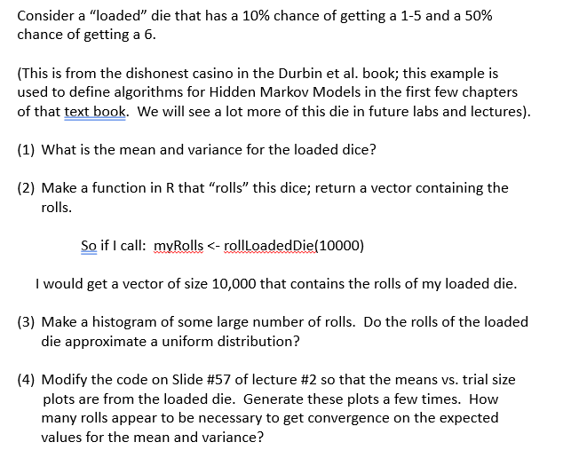

```{r setup, include=FALSE}
knitr::opts_chunk$set(echo = TRUE)
```

## R Markdown



```{r question 1}

prob = c(.1,.1,.1,.1,.1,.5)

mean <- vector("double", 6)
# mean = 1*.1 + 2*.1 + 3*.1 + 4*.1 + 5*.1 + 6*.5
for( i in 1:6 ){mean[i] <- (prob[i]*i)}
mean <- sum(mean)


var <- vector("double", 6)
# for( i in 1:6 ){var[i] <- (prob[i]*(i**2)) - (mean**2)}
for( i in 1:6 ){var[i] <- (prob[i])*(i - mean)**2}
var = sum(var)

print(paste("mean:", mean, "variance:", var))


```

## Including Plots

You can also embed plots, for example:

```{r question 2}

rollLoadedDie <- function(numrolls){
  ## given a number of rolls, returns a simulated experiment
  
  # final_vec = vector("double", numrolls)

  # rolls <- runif(numrolls,0,1)
  # 
  # final_vec[rolls <= .1] <- 1
  # final_vec[rolls > .1 & rolls <= .2] <- 2
  # final_vec[rolls > .2 & rolls <= .3] <- 3
  # final_vec[rolls > .3 & rolls <= .4] <- 4
  # final_vec[rolls > .4 & rolls <= .5] <- 5
  # final_vec[rolls > .5] <- 6
  
  final_vec <- sample(1:6, numrolls, prob = c(.1,.1,.1,.1,.1,.5), replace = TRUE)
  return(final_vec)
}
  
  

myRolls <- rollLoadedDie(10000)

for (i in 1:6) {print( paste("there are", length(myRolls[myRolls == i] ),"of the number" ,i) )}


```

Note that the `echo = FALSE` parameter was added to the code chunk to prevent printing of the R code that generated the plot.

```{r question 3}
hist(rollLoadedDie(100000))
```

```{r}

trialSizes <- c(5, 10, 20, 25, 30, 40, 50, 100, 200, 300, 400, 500, 1000, 2000, 3000, 4000, 5000, 10000, 20000, 30000, 100000, 1000000, 5000000, 10000000, 50000000, 100000000)

means <- vector(mode = "double", length=length(trialSizes))

variances <- vector(mode = "double", length=length(trialSizes))

for( i in 1:length(trialSizes) ){

  means[i] <- mean(rollLoadedDie(trialSizes[i]))
  variances[i] <- var(rollLoadedDie(trialSizes[i]))
  
}


```

\

```{r}
plot( log10(trialSizes), means )
lines(log10(trialSizes), rep(mean, length(trialSizes)))
```

```{r}
plot( log10(trialSizes), variances )
lines(log10(trialSizes), rep(var, length(trialSizes)))
```

```{r}
## plot of the difference from the expected mean
plot(log10(trialSizes), abs(means-mean))
lines(log10(trialSizes), rep(0.5, length(trialSizes)))

## plot of the difference from the expected variance
plot(log10(trialSizes), abs(variances-var))
lines(log10(trialSizes), rep(0.5, length(trialSizes)))
```

**How many rolls appear to be necessary to get convergence on the expected values on the expected values for mean and variance?**

As we can see in the plot above, beginning at trial 1000 the difference between the actual and expected mean is consistently below 0.5. Similarly, after trial 1000, the difference between the actual and expected variance tends to be below 0.
